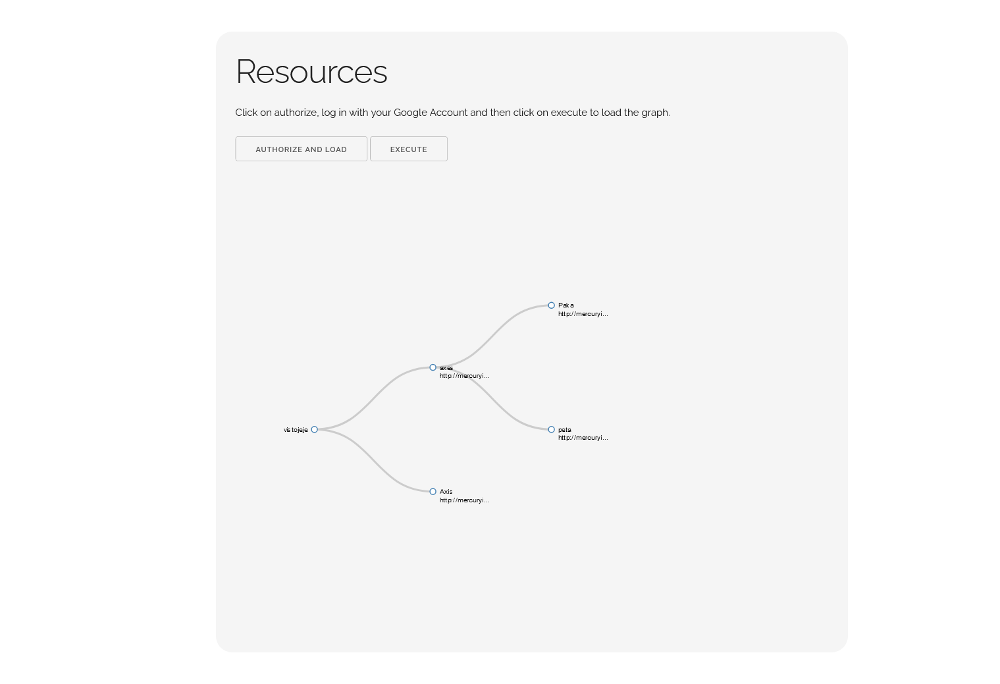

Based on Kyhao D3.js collapsible tree 
[https://kyhau.github.io/d3-collapsible-tree-demo/collapsible_tree.html](https://kyhau.github.io/d3-collapsible-tree-demo/collapsible_tree.html).

# How to use

## Firebase

1. Download/clone the repository
2. Add your OAuth keys in main.js in the first lines
3. Create a Firestore database. Documents must/can have the following fields:
   1. 'name' - Mandatory
   2. 'link'
   3. Create children nodes by creating a collection called children in each node.
4. Add the firebase database id and root collection to main.js config.databasePath variable.

## JSON

1. Use commit files: https://github.com/memoriasIT/ResourceLinkTree/tree/4874eea6aad0a6061c2e2348f9126f7fc8e81965
2. Clone and open, you are good to go! 

# Demo Image

